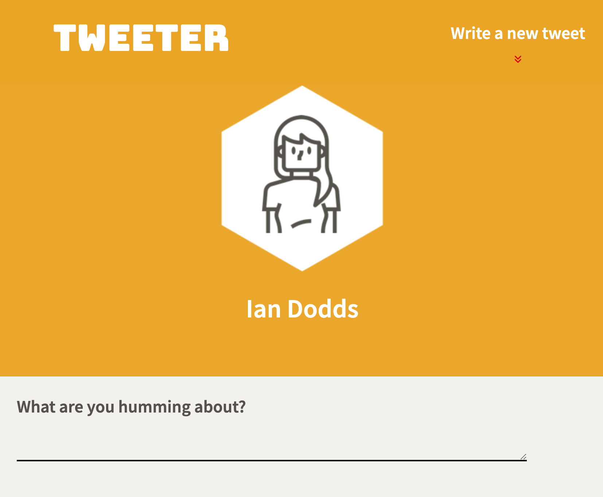
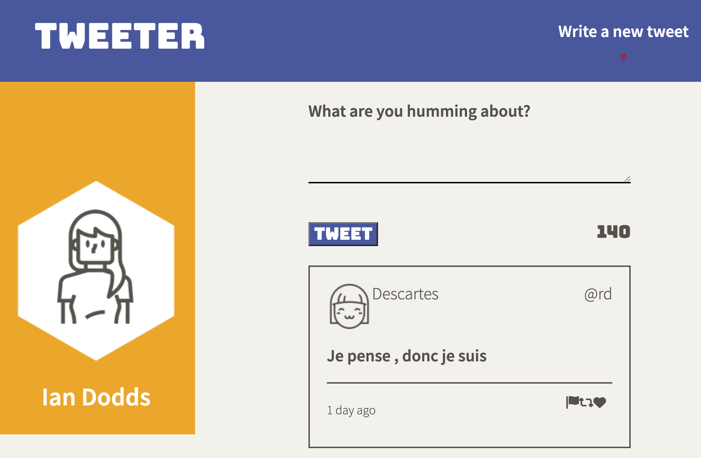

# Tweeter Project

Tweeter is a single-page Twitter clone, where users can create short posts of up to 140 characters and have them append to the main page. Tweeter is based off of the [Lighthouse Labs](https://www.lighthouselabs.ca/) Web Development Bootcamp [Project](https://github.com/lighthouse-labs/tweeter).

## Quick Start

* Clone the repo to your computer and run `npm install` to grab dependencies.
* Run `npm start` to launch Tweeter server
* Open browser to `localhost:8080` to start using Tweeter.

## Final Product

## Dependencies

- Express
- Node 5.10.x or above
